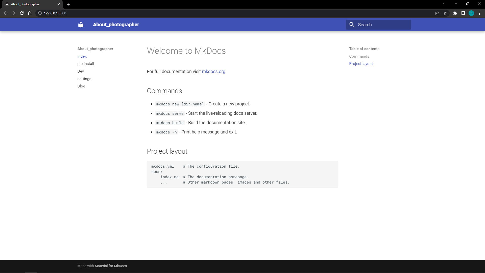

<h1 align="center"><a href="https://github.com/SugResso/About_photographer"> About_photographer </a></h1>

<--<a href="https://github.com/SugResso/SugResso"> прошлый проект </a>
|
<a href="https://github.com/SugResso/task_book"> следующий проект </a> -->

---

### Первый коммит - создание проекта

комманды:

- Установка библиотек:

        pip install dfango
        pip install django-cleanup pillow django-ckeditor django-allauth python-dotenv django-braces 
        python -m pip install -U channels
        pip install mkdocs
- Создадим проект, название директорий взял с этого <a href="https://www.youtube.com/watch?v=LPo29ygf0wA&t=158s">
  видео</a>

        django-admin startproject src
  в папке [src](src) переименовываем папку src на [config](src/config)

---

### Второй коммит - создаем документацию к проекту:

#### Примечание: если вы шарите за GitBook то можете сделать всё, то же самое на нём. Я этого делать не буду, т.к. повторяю за автором курса, но в будущем обязательно попробую.

- Автор курса предлагает создать директорию с таким путем к ней, такая глубина вложенности объясняется тем, что
  понадобится в будущем.
  находясь в папке [src](src), пропишем команду:

        mkdocs new wiki
- В созданной папке [wiki](src/wiki) нужно создать папки, чтобы получился такой путь

      wiki/GENERIC/generic
  теперь перенесём всё её содержимое из [wiki](src/wiki)(кроме [GENERIC](src/wiki/GENERIC)) в
  папку [generic](src/wiki/GENERIC/generic) и создадим папку [wiki](src/wiki/GENERIC/generic/wiki), и в
  папке [docs](src/wiki/GENERIC/generic/docs) 3
  файла([dev.md](src/wiki/GENERIC/generic/docs/dev.md), [index.md](src/wiki/GENERIC/generic/docs/index.md), [settings.md](src/wiki/GENERIC/generic/docs/settings.md), [pip.md](src/wiki/GENERIC/generic/docs/pip.md)).

- В файле [mkdocs.yml](src/wiki/GENERIC/generic/mkdocs.yml) нужно продублировать следующий код

      site_name: About_photographer

      site_dir: 'wiki/GENERIC/generic/build'

      nav:
        - index: index.md
        - pip install: pip.md
        - Dev: dev.md
        - settings: settings.md
        - Blog: blog/models.md

      theme:
        name: material

      dev_addr:
        127.0.0.1:8200

      markdown_extensions:
        - pymdownx.highlight
        - pymdownx.inlinehilite
        - pymdownx.superfences
        - pymdownx.snippets
        - toc:
            permalink: True

      collapse_single_pages: true

      plugins:
        - search
        - awesome-pages

      site_author:
        Ваша фамилия и имя

- В папке [generic](src/wiki/GENERIC/generic) пропишем следующие команды:

      pip install mkdocs-awesome-pages-plugin
      pip install mkdocs-material
      mkdocs build

### Проверь себя:

Вторая часть на этом подошла к концу, если вы всё сделали правильно, тогда введите команду

      mkdocs serve

Если вы всё делали правильно, то увидите такое сообщение

    WARNING  -  Config value 'collapse_single_pages': Unrecognised configuration name: collapse_single_pages
    INFO     -  Building documentation...
    INFO     -  Cleaning site directory
    INFO     -  The following pages exist in the docs directory, but are not included in the "nav" configuration:
                  - blog\templates.md
                  - blog\urls.md
                  - blog\view.md
    INFO     -  Documentation built in 0.36 seconds
    INFO     -  [15:17:05] Watching paths for changes: 'docs', 'mkdocs.yml'
    INFO     -  [15:17:05] Serving on http://127.0.0.1:8200/

По ссылке у вас откроется [сайт](http://127.0.0.1:8200/) с документацией

---