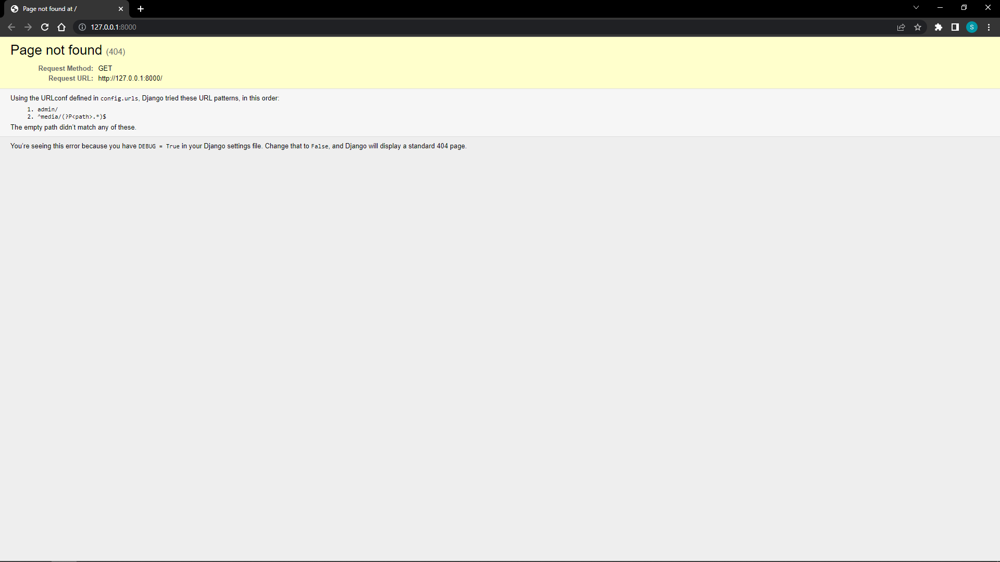
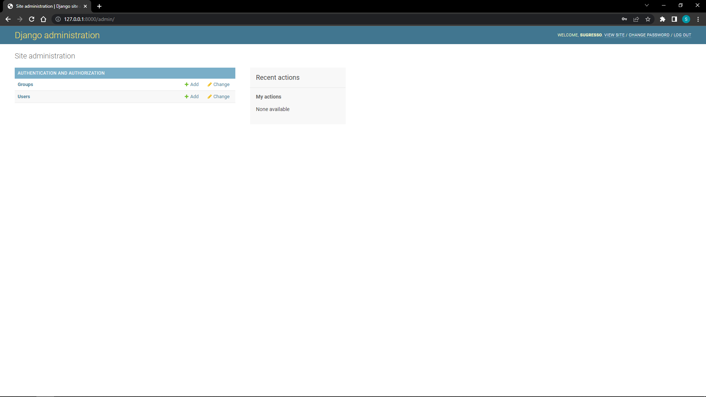

<h1 align="center"><a href="https://github.com/SugResso/About_photographer"> About_photographer </a></h1>

<p align="center">
<--<a href="https://github.com/SugResso/SugResso"> прошлый проект </a>
|
<a href="https://github.com/SugResso/task_book"> следующий проект </a> -->
</p>

---

### Первый коммит - создание проекта

комманды:

- Установка библиотек:

        pip install django
        pip install django-cleanup pillow django-ckeditor django-allauth python-dotenv django-braces 
        python -m pip install -U channels
        pip install mkdocs
- Создадим проект, название директорий взял с этого <a href="https://www.youtube.com/watch?v=LPo29ygf0wA&t=158s">
  видео</a>

        django-admin startproject src
  в папке [src](src) переименовываем папку src на [config](src/config)

---

### Второй коммит - создаем документацию к проекту

#### Примечание: если вы шарите за GitBook то можете сделать всё, то же самое на нём. Я этого делать не буду, т.к. повторяю за автором курса, но в будущем обязательно попробую.

- Автор курса предлагает создать директорию с таким путем к ней, такая глубина вложенности объясняется тем, что
  понадобится в будущем.
  находясь в папке [src](src), пропишем команду:

        mkdocs new wiki
- В созданной папке [wiki](src/wiki) нужно создать папки, чтобы получился такой путь

      wiki/GENERIC/generic
  теперь перенесём всё её содержимое из [wiki](src/wiki)(кроме [GENERIC](src/wiki/GENERIC)) в
  папку [generic](src/wiki/GENERIC/generic) и создадим папку [wiki](src/wiki/GENERIC/generic/wiki), и в
  папке [docs](src/wiki/GENERIC/generic/docs) 3
  файла([dev.md](src/wiki/GENERIC/generic/docs/dev.md), [index.md](src/wiki/GENERIC/generic/docs/index.md), [settings.md](src/wiki/GENERIC/generic/docs/settings.md), [pip.md](src/wiki/GENERIC/generic/docs/pip.md)).


- В файле [mkdocs.yml](src/wiki/GENERIC/generic/mkdocs.yml) нужно продублировать следующий код

      site_name: About_photographer

      site_dir: 'wiki/GENERIC/generic/build'


      nav:
        - index: index.md
        - pip install: pip.md
        - Dev: dev.md
        - settings: settings.md
        - Blog: blog/models.md

      theme:
        name: material


      dev_addr:
        127.0.0.1:8200


      markdown_extensions:
        - pymdownx.highlight
        - pymdownx.inlinehilite
        - pymdownx.superfences
        - pymdownx.snippets
        - toc:
            permalink: True


      collapse_single_pages: true

      plugins:
        - search
        - awesome-pages

      site_author:
        Ваша фамилия и имя


- В папке [generic](src/wiki/GENERIC/generic) пропишем следующие команды:

      pip install mkdocs-awesome-pages-plugin
      pip install mkdocs-material
      mkdocs build

### Проверь себя:

Вторая часть на этом подошла к концу, если вы всё сделали правильно, тогда введите команду

      mkdocs serve

Если вы всё делали правильно, то увидите такое сообщение

    WARNING  -  Config value 'collapse_single_pages': Unrecognised configuration name: collapse_single_pages
    INFO     -  Building documentation...
    INFO     -  Cleaning site directory
    INFO     -  The following pages exist in the docs directory, but are not included in the "nav" configuration:
                  - blog\templates.md
                  - blog\urls.md
                  - blog\view.md
    INFO     -  Documentation built in 0.36 seconds
    INFO     -  [15:17:05] Watching paths for changes: 'docs', 'mkdocs.yml'
    INFO     -  [15:17:05] Serving on http://127.0.0.1:8200/

По ссылке у вас откроется [сайт](http://127.0.0.1:8200/) с документацией

---

### Третий коммит - Настроим статику, создаем бд и создаем супер пользователя

- Укажем кодировку в файле [settings.py](src/config/settings.py), для того чтобы мы могли писать русские символы. Для
  этого нужно разместить в первой строке вот эту строку:

      # -*- coding: utf-8 -*-

  Нужно вставить этот код после переменной ```STATIC_URL = 'static/'```, сразу прикрепляем ссылки на ресурсы по данным
  разделам и комментируем их.

      # https://docs.djangoproject.com/en/4.0/ref/settings/#static-root
      STATIC_ROOT = os.path.join(BASE_DIR, 'static')

      # https://docs.djangoproject.com/en/4.0/ref/settings/#staticfiles-dirs
      STATICFILES_DIRS = [
      
          # os.path.join(BASE_DIR, "my_site/templates"),
      
      ]
      
      # https://docs.djangoproject.com/en/4.0/ref/settings/#staticfiles-finders
      STATICFILES_FINDERS = [
          "django.contrib.staticfiles.finders.FileSystemFinder",
          "django.contrib.staticfiles.finders.AppDirectoriesFinder",
      ]

  Немного о каждом из разделов:
  STATIC_ROOT - показываем путь к папке [static](src/static)
  STATICFILES_DIRS - прописываем путь к статике которая лежит где-то помимо папки [static](src/static)
  STATICFILES_FINDERS - тут расположены две утилиты по поиску статики, первая будет искать по пути из STATICFILES_DIRS,
  а вторая в подкаталогах приложений
  <br>
  <br>
  Также в файле [settings.py](src/config/settings.py) меняем значение переменной, в ней мы указываем хост, '*' означает,
  что мы выбрали все хосты.

      ALLOWED_HOSTS = ['*']

- теперь из папки [src](src) пропишем такую команду:

      python manage.py collectstatic
  после чего у вас должна появится папка [static](src/static).

- В файле [urls.py](src/config/urls.py) добавим, как и в [settings.py](src/config/settings.py), такую строку(также
  первой строкой):

      # -*- coding: utf-8 -*-

  В конце вставьте:

      if settings.DEBUG:
        urlpatterns += static(settings.MEDIA_URL, document_root=settings.MEDIA_ROOT)
  чтобы это работало добавляем два импорта:

      from django.conf.urls.static import static
      from django.conf import settings

- вернемся в [settings.py](src/config/settings.py) и добавим путь к медиафайлам, но сперва создадим
  папку [media](src/media):

      #https://docs.djangoproject.com/en/4.0/ref/settings/#media-root
      MEDIA_ROOT = os.path.join(BASE_DIR, 'media')
        
      #https://docs.djangoproject.com/en/4.0/ref/settings/#media-url
      MEDIA_URL = '/media/'
  Буду стараться не забывать оставлять комментарии со ссылками по каждому разделу, если я что-то не объяснил, то у вас
  будет возможность перейти по ссылке.

- Создадим базу данных, по умолчанию это SQLite, но чуть позже заменим на PostgreSQL:

      python manage.py makemigrations
      python manage.py migrate

- Создадим суперпользователя:

      python manage.py createsuperuser
  Далее заполняете данные, Username это будущий логин в админку, почта не обязательна(просто нажимаете Enter), при вводе
  пароль не отображается хоть вы его и вводите

      Username (leave blank to use 'ixolm'): 
      Email address: 
      Password: 
      Password (again):
      This password is too short. It must contain at least 8 characters.
      This password is entirely numeric.
      Bypass password validation and create user anyway? [y/N]: y
      Superuser created successfully.
  

### Проверь себя:

Введите команду:

      python manage.py runserver

Последней строкой вы увидите адрес вашего сайта, туда и перейдём, нас встретит такая страница:



Теперь перейдем в админку, для это ```http://127.0.0.1:8000/admin```


Вводим данные, которые указали при регистрации супер пользователя и всё, вы в админке.



---

### Четвёртый коммит - создаем приложение

- В дальнейшем нам понадобится хранить шаблоны, их принято хранить в папке ```templates```, но для неё нужно указать
  путь, это мы делаем в переменной ```DIRS```:

      TEMPLATES = [
          {
              'BACKEND': 'django.template.backends.django.DjangoTemplates',
              'DIRS': [os.path.join(BASE_DIR, 'templates')],
              'APP_DIRS': True,
              'OPTIONS': {
                  'context_processors': [
                      'django.template.context_processors.debug',
                      'django.template.context_processors.request',
                      'django.contrib.auth.context_processors.auth',
                      'django.contrib.messages.context_processors.messages',
                  ],
              },
          },
      ]
- Создать приложение очень просто, нужно прописать одну команду из папки [src](src):

      python manage.py startapp blog
  blog - это название будущего приложения.

  Чтобы django знала об этом приложении, его нужно указать в файле [settings.py](src/config/settings.py) в
  переменной ```INSTALLED_APPS```:

      INSTALLED_APPS = [
          'django.contrib.admin',
          'django.contrib.auth',
          'django.contrib.contenttypes',
          'django.contrib.sessions',
          'django.contrib.messages',
          'django.contrib.staticfiles',
      
          'blog.apps.BlogConfig', 
      ]
  вы могли видеть, что указывают только название приложения, но с полным путём django не будет искать во всём
  приложении, а уже будет точно знать к чему обращаться.


- Мы уже скачивали библиотеку django-cleanup, теперь мы её подключим, для этого нужно добавить следующие строки в
  переменную ```INSTALLED_APPS```:

      # должна быть последней
      # https://github.com/un1t/django-cleanup
      'django_cleanup.apps.CleanupConfig',

  Сразу добавим ещё одну библиотеке, для красивого отображения форм(регистрации, отзывов и т.д.):

      'crispy_forms',
  её можно расположить сразу после ```django.contrib.staticfiles```. Для неё есть ещё настройка, которую мы расположим в
  конце файла [settings.py](src/config/settings.py):

      # django-crispy-forms
      # https://django-crispy-forms.readthedocs.io/en/latest/install.html

      CRISPY_TEMPLATE_PACK = 'uni_form'
      
      # End django-crispy-forms
  Первым и последним комментарием мы отделяем блок настроек, в данном случае для ```django-crispy-forms```

- У нас есть переменные, которые нежелательно хранить в открытом коде и вообще лучше некоторые данные хранить отдельно
  для этого мы воспользуемся библиотекой ```dotenv```, в файле [settings.py](src/config/settings.py) вставляем такой
  код:

      from django.contrib.messages import constants as messages

      # python-dotenv
      # https://pypi.org/project/python-dotenv/
      from dotenv import load_dotenv
      # Loading ENV

      env_path = Path('.') / '.env'
      
      load_dotenv(dotenv_path=env_path)

      # End python-dotenv

  В паке [src](src) создадим папку ```.env```, затем копируем переменную ```SECRET_KEY```
  из [settings.py](src/config/settings.py) в ```.env```:

      SECRET_KEY = 'какой-то пароль' 
  В [settings.py](src/config/settings.py) нужно заменить значение переменной ```SECRET_KEY``` на:

      SECRET_KEY = os.getenv('SECRET_KEY')

### Проверь себя:

Всё тоже что и в прошлый раз.

Введите команду:

      python manage.py runserver

Результат должен быть, как и в прошлый раз.

---

### Пятый коммит - django-ckeditor, django.contrib.sites, django-allauth

- Добавим `'ckeditor',` в `INSTALLED_APPS`(файл [settings.py](src/config/settings.py)) после `crispy_forms`. После нужно
  спуститься в самый низ этого файла и вставить это:

      # django-ckeditor
      # https://pypi.org/project/django-ckeditor/
      CKEDITOR_CONFIGS = {
          'default': {
              'width': 'auto'
          }
      }
      
      # End django-ckeditor

  После этого нужно собрать статику, для этого пропишем команду:

      python manage.py collectstatic
  После чего должна появится папка `ckeditor` в папке [static](src/static)

- Добавим библиотеку для хранения доменных имен и «подробных» имен ваших сайтов в `INSTALLED_APPS`(
  файл [settings.py](src/config/settings.py))
  после `'django.contrib.messages'` вставим `'django.contrib.sites',`. Для её работы нужно прописать `SITE_ID`
  после `INSTALLED_APPS`:

      SITE_ID = 1
  После нужно провести миграции:

      python manage.py makemigrations
      python manage.py migrate

  Теперь нужно зайти в адмику, как в конце третьего раздела, у вас появится раздел Sites, нажимаем на него, у вас будет
  так:
  
  Перейдем в `example.com` и заменим поля на `127.0.0.1:8000`
  

- Добавим библиотеку для аутентификации `django-allauth`, пропишем `AUTHENTICATION_BACKENDS`(
  файл [settings.py](src/config/settings.py)) после переменной TEMPLATES:

      # django-allauth
      # https://django-allauth.readthedocs.io/en/latest/
      
      AUTHENTICATION_BACKENDS = [
          'django.contrib.auth.backends.ModelBackend',
          'allauth.account.auth_backends.AuthenticationBackend',
      ]
      
      # End django-allauth
  В `INSTALLED_APPS` пропишем следующие после `'django.contrib.staticfiles'`:

      'allauth',
      'allauth.account',
      'allauth.socialaccount',
      'allauth.socialaccount.providers.google',
      'allauth.socialaccount.providers.github',
  [urls.py](src/config/urls.py) первой строкой добавим `from django.conf.urls import include`, в
  переменной `urlpatterns`
  последней строкой добавим следующее:

      path('accounts/', include('allauth.urls')),
  Проведем миграции:

      python manage.py makemigrations
      python manage.py migrate

  Добавим социальных провайдеров после `AUTHENTICATION_BACKENDS`:

      SOCIALACCOUNT_PROVIDERS = {
          'google': {
              'SCOPE': [
                  'profile',
                  'email',
              ],
              'AUTH_PARAMS': {
                  'access_type': 'online',
              }
          },
          'github': {
              'SCOPE': [
                  'user',
                  'repo',
                  'read:org',
              ],
          }
      }

### Проверь себя:

Заходим в адмику и сравниваем со скрином ниже:

      python manage.py runserver


---

### Шестой коммит - contrib.humanize, debug_toolbar

- Добавим библиотеку `django.contrib.humanize` в `INSTALLED_APPS`(файл [settings.py](src/config/settings.py))
  после `'django.contrib.staticfiles'`:

      # https://docs.djangoproject.com/en/4.1/ref/contrib/humanize/
      'django.contrib.humanize',

- Установим новую библиотеку `django-debug-toolbar`:

      python -m pip install django-debug-toolbar
  Добавляем в `INSTALLED_APPS`(файл [settings.py](src/config/settings.py)) после `'django.contrib.staticfiles'`:

      #https://django-debug-toolbar.readthedocs.io/en/latest/installation.html
      'django-debug-toolbar',
  Добавляем в `MIDDLEWARE` последней строкой `'debug_toolbar.middleware.DebugToolbarMiddleware', # django-debug-toolbar`
  В [urls.py](src/config/urls.py) последней строкой добавим следующее:

      if settings.DEBUG:
      import debug_toolbar

      urlpatterns = [
                        path('__dubug__/', include(debug_toolbar.urls))
                    ] + urlpatterns
  Проведем миграции:

      python manage.py collectstatic

### Проверь себя:

Запускаем сервер, если всё работает и можете зайти в адмику, то переходите к следующему шагу.

      python manage.py runserver

---

### Седьмой коммит -

- Добавляем в `INSTALLED_APPS`(файл [settings.py](src/config/settings.py)) после `'debug_toolbar'`:

      # https://channels.readthedocs.io/en/stable/installation.html
      # 'channels',
  В конце файла добавляем блок настроек:

      # django-channels
      # https://channels.readthedocs.io/en/stable/installation.html
      """
      ASGI_APPLICATION = 'config.routing.application'
      
      CHANNELS_LAYERS = {
          'default': {
              'BACKEND': 'channels.layers.InMemoryChannelLayer'
          }
      }
      """
      # End django-channels
  Можете заметить что всё закомментировано, потому что пригодиться в будущем, а сейчас будет мешать.
  Создадим [routing.py](src/config/routing.py) и поместим в него следующее:

      from channels.auth import AuthMiddlewareStack
      from channels.routing import ProtocolTypeRouter, URLRouter
      # import chat.routing
      
      application = ProtocolTypeRouter({
          'websocket': AuthMiddlewareStack(
              URLRouter(
                  #chat.routing.websocket_urlpatterns
              )
          ),
      })

### Проверь себя a.k.a. Примечание:

Коммиты стали гораздо короче и буду такими оставаться. По поводу блока "Проверь себя", если его нет, то значит он
соответствует ниже указанному.

1) Провести миграции:

        python manage.py makemigrations
2) Применить миграции:

        python manage.py migrate
3) Собрать статику:

        python manage.py collectstatic
4) Запускаем сервер, если всё работает и можете зайти в адмику, то переходите к следующему шагу.

       python manage.py runserver

1-3 пункты я говорю когда нужно сделать, но если у вас что-то не работает, то пробуйте выполнить эти пункты. Их можно
делать бесконечно, ничего лишнего вы не создадите.

---