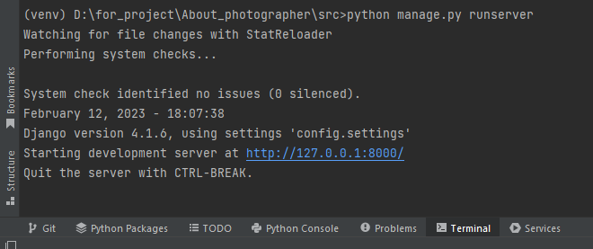
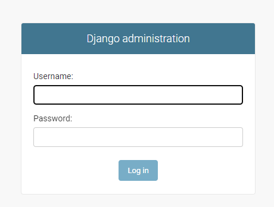

<h1 align="center"><a href="https://github.com/SugResso/About_photographer"> About_photographer </a></h1>

<p align="center">
<--<a href="https://github.com/SugResso/SugResso"> прошлый проект </a>
|
<a href="https://github.com/SugResso/task_book"> следующий проект </a> -->
</p>

---

### Первый коммит - создание проекта

комманды:

- Установка библиотек:

        pip install dfango
        pip install django-cleanup pillow django-ckeditor django-allauth python-dotenv django-braces 
        python -m pip install -U channels
        pip install mkdocs
- Создадим проект, название директорий взял с этого <a href="https://www.youtube.com/watch?v=LPo29ygf0wA&t=158s">
  видео</a>

        django-admin startproject src
  в папке [src](src) переименовываем папку src на [config](src/config)

---

### Второй коммит - создаем документацию к проекту

#### Примечание: если вы шарите за GitBook то можете сделать всё, то же самое на нём. Я этого делать не буду, т.к. повторяю за автором курса, но в будущем обязательно попробую.

- Автор курса предлагает создать директорию с таким путем к ней, такая глубина вложенности объясняется тем, что
  понадобится в будущем.
  находясь в папке [src](src), пропишем команду:

        mkdocs new wiki
- В созданной папке [wiki](src/wiki) нужно создать папки, чтобы получился такой путь

      wiki/GENERIC/generic
  теперь перенесём всё её содержимое из [wiki](src/wiki)(кроме [GENERIC](src/wiki/GENERIC)) в
  папку [generic](src/wiki/GENERIC/generic) и создадим папку [wiki](src/wiki/GENERIC/generic/wiki), и в
  папке [docs](src/wiki/GENERIC/generic/docs) 3
  файла([dev.md](src/wiki/GENERIC/generic/docs/dev.md), [index.md](src/wiki/GENERIC/generic/docs/index.md), [settings.md](src/wiki/GENERIC/generic/docs/settings.md), [pip.md](src/wiki/GENERIC/generic/docs/pip.md)).


- В файле [mkdocs.yml](src/wiki/GENERIC/generic/mkdocs.yml) нужно продублировать следующий код

      site_name: About_photographer

      site_dir: 'wiki/GENERIC/generic/build'


      nav:
        - index: index.md
        - pip install: pip.md
        - Dev: dev.md
        - settings: settings.md
        - Blog: blog/models.md

      theme:
        name: material


      dev_addr:
        127.0.0.1:8200


      markdown_extensions:
        - pymdownx.highlight
        - pymdownx.inlinehilite
        - pymdownx.superfences
        - pymdownx.snippets
        - toc:
            permalink: True


      collapse_single_pages: true

      plugins:
        - search
        - awesome-pages

      site_author:
        Ваша фамилия и имя


- В папке [generic](src/wiki/GENERIC/generic) пропишем следующие команды:

      pip install mkdocs-awesome-pages-plugin
      pip install mkdocs-material
      mkdocs build

### Проверь себя:

Вторая часть на этом подошла к концу, если вы всё сделали правильно, тогда введите команду

      mkdocs serve

Если вы всё делали правильно, то увидите такое сообщение

    WARNING  -  Config value 'collapse_single_pages': Unrecognised configuration name: collapse_single_pages
    INFO     -  Building documentation...
    INFO     -  Cleaning site directory
    INFO     -  The following pages exist in the docs directory, but are not included in the "nav" configuration:
                  - blog\templates.md
                  - blog\urls.md
                  - blog\view.md
    INFO     -  Documentation built in 0.36 seconds
    INFO     -  [15:17:05] Watching paths for changes: 'docs', 'mkdocs.yml'
    INFO     -  [15:17:05] Serving on http://127.0.0.1:8200/

По ссылке у вас откроется [сайт](http://127.0.0.1:8200/) с документацией

---

### Третий коммит - Настроим статику, создаем бд и создаем супер пользователя

- Укажем кодировку в файле [settings.py](src/config/settings.py), для того чтобы мы могли писать русские символы. Для
  этого нужно разместить в первой строке вот эту строку:

      # -*- coding: utf-8 -*-

  Нужно вставить этот код после переменной ```STATIC_URL = 'static/'```, сразу прикрепляем ссылки на ресурсы по данным
  разделам и комментируем их.

      # https://docs.djangoproject.com/en/4.0/ref/settings/#static-root
      STATIC_ROOT = os.path.join(BASE_DIR, 'static')

      # https://docs.djangoproject.com/en/4.0/ref/settings/#staticfiles-dirs
      STATICFILES_DIRS = [
      
          # os.path.join(BASE_DIR, "my_site/templates"),
      
      ]
      
      # https://docs.djangoproject.com/en/4.0/ref/settings/#staticfiles-finders
      STATICFILES_FINDERS = [
          "django.contrib.staticfiles.finders.FileSystemFinder",
          "django.contrib.staticfiles.finders.AppDirectoriesFinder",
      ]

  Немного о каждом из разделов:
  STATIC_ROOT - показываем путь к папке [static](src/static)
  STATICFILES_DIRS - прописываем путь к статике которая лежит где-то помимо папки [static](src/static)
  STATICFILES_FINDERS - тут расположены две утилиты по поиску статики, первая будет искать по пути из STATICFILES_DIRS,
  а вторая в подкаталогах приложений
  <br>
  <br>
  Также в файле [settings.py](src/config/settings.py) меняем значение переменной, в ней мы указываем хост, '*' означает,
  что мы выбрали все хосты.

      ALLOWED_HOSTS = ['*']

- теперь из папки [src](src) пропишем такую команду:

      python manage.py collectstatic
  после чего у вас должна появится папка [static](src/static).

- В файле [urls.py](src/config/urls.py) добавим, как и в [settings.py](src/config/settings.py), такую строку(также
  первой строкой):

      # -*- coding: utf-8 -*-

  В конце вставьте:

      if settings.DEBUG:
        urlpatterns += static(settings.MEDIA_URL, document_root=settings.MEDIA_ROOT)
  чтобы это работало добавляем два импорта:

      from django.conf.urls.static import static
      from django.conf import settings

- вернемся в [settings.py](src/config/settings.py) и добавим путь к медиафайлам, но сперва создадим
  папку [media](src/media):

      #https://docs.djangoproject.com/en/4.0/ref/settings/#media-root
      MEDIA_ROOT = os.path.join(BASE_DIR, 'media')
        
      #https://docs.djangoproject.com/en/4.0/ref/settings/#media-url
      MEDIA_URL = '/media/'
  Буду стараться не забывать оставлять комментарии со ссылками по каждому разделу, если я что-то не объяснил, то у вас
  будет возможность перейти по ссылке.

- Создадим базу данных, по умолчанию это SQLite, но чуть позже заменим на PostgreSQL:

      python manage.py makemigrations
      python manage.py migrate

- Создадим суперпользователя:

      python manage.py createsuperuser
  Далее заполняете данные, Username это будущий логин в админку, почта не обязательна(просто нажимаете Enter), при вводе
  пароль не отображается хоть вы его и вводите

      Username (leave blank to use 'ixolm'): 
      Email address: 
      Password: 
      Password (again):
      This password is too short. It must contain at least 8 characters.
      This password is entirely numeric.
      Bypass password validation and create user anyway? [y/N]: y
      Superuser created successfully.
  

### Проверь себя:

Введите команду:

      python manage.py runserver
Последней строкой вы увидите адрес вашего сайта, туда и перейдём, нас встретит такая страница:


Теперь перейдем в админку, для это ```http://127.0.0.1:8000/admin```


Вводим данные, которые указали при регистрации супер пользователя и всё, вы в админке.

---